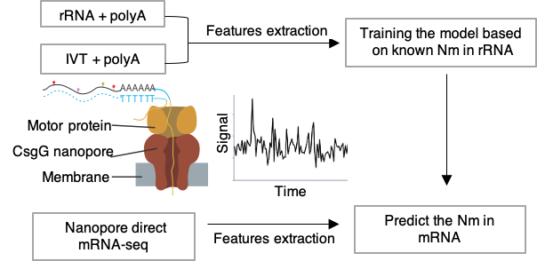

# NanoNm version 1.0.0

# A Machine Learning Method to detect the 2'-O-methylation(Nm) in Nanopore direct RNA-seq
Codes developed on the top of  Nanom6A (Gao et al. Genome Biology. 2021 https://github.com/gaoyubang/nanom6A)
# Citation
If using the software in a publication, please cite the following:
Yanqiang Li et.al 2′-O-methylation at internal sites on mRNA promotes mRNA stability. Molecular Cell (2024)
https://www.cell.com/molecular-cell/abstract/S1097-2765(24)00326-5

# The Flowchart of NanoNm
<p>Flowchart of a machine learning model to detect Nm based on Nanopore direct RNA-seq.</p>
</img>

# Step0. Install the conda environment first
```
conda env create -f Nanopore.environment.yml      #install conda environment
conda install -c bioconda ont-fast5-api #install ont-fast5 for multi_to_single_fast5
install guppy_basecaller #download software from Nanopore community.
conda install -c bioconda ont-tombo #install tombo 
```
# Step1. Extract the features of Nanopore direct RNA-seq of rRNA.
# $id means sample of each fast5 file
## 1.1 Split the multiple fast5 to single fast5 files
```
multi_to_single_fast5  -i ${id}.fast5 -s $id  --recursive -t 40
```
## 1.2 Base calling using guppy_basecaller
```
guppy_basecaller --input_path $id --save_path $id_guppy --num_callers 40 --recursive --fast5_out --config rna_r9.4.1_70bps_hac.cfg  --cpu_threads_per_caller 10
```
## 1.3 Resquiggle the signal of fast5 files to each transcript
```
tombo resquiggle --rna --overwrite  ${id}\_guppy/workspace/  human_uniq.rRNA.fa    --processes 40 --fit-global-scale --include-event-stdev 
```
## 1.4 Feature calling of each transcripts
```
find  ${id}\_guppy/workspace/ -name "*.fast5" >${id}_guppy.list
python extract_raw_and_feature_fast_AUCG.py  --cpu=30 --fl = ${id}_guppy.list -o ${id}_guppy.feature --clip=5
```
## 1.5 Map the reads to the rRNA
```
minimap2  -ax map-ont -uf -k14 -x splice -t 20 human_uniq.rRNA.fa    ${id}_guppy.feature.feature.fa|samtools view -@ 20 -bS - |samtools sort -@ 20 -     >${id}.rRNA.sort.bam
sam2tsv -r ./rRNA/human_uniq.rRNA.fa   ${id}.rRNA.sort.bam >${id}.rRNA.sort.bam.tsv
```
## 1.6 Extract the features of fast5 files of Nm sites in rRNA
```
python  filter_get.fast5.py  -i ${id}.rRNA.sort.bam.tsv -b rRNA.Nm1.bed  -f ${id}_guppy.feature.feature.tsv -o ${id}.fast5.rRNA.signal.txt   >${id}.rRNA.feature.anno.txt
```
# Step2. Training the 2'-O-methylation model from the Nanopore direct RNA-seq of rRNA
```
cat kmer.txt|xargs -i -e echo "python train_model_scale_pos_weight_Nm.py  {} >>Auc.scale1.txt & " |sh
```
# Step3. Predict the 2'-O-methylation in the mRNA
```

#downloaded gencode.v27.transcripts.fa  from https://ftp.ebi.ac.uk/pub/databases/gencode/Gencode_human/release_27/gencode.v27.transcripts.fa.gz


multi_to_single_fast5  -i ${id}.fast5 -s $id  --recursive -t 40

guppy_basecaller --input_path $id --save_path $id_guppy --num_callers 40 --recursive --fast5_out --config rna_r9.4.1_70bps_hac.cfg  --cpu_threads_per_caller 10

tombo resquiggle --rna --overwrite  ${id}\_guppy/workspace/  gencode.v27.transcripts.fa    --processes 40 --fit-global-scale --include-event-stdev 


python extract_raw_and_feature_fast_AUCG.py  --cpu=30 --fl = ${id}_guppy.list -o ${id}_guppy.feature --clip=5

cat *.feature.feature.fa >all.feature.fa

cat *.feature.feature.tsv >all.feature.tsv 

python predict_sites_Nm.final.py   --model ./model --cpu 20  -i all -o all_Nm_model -r  gencode.v27.transcripts.fa  -g GRCh38.p13.genome.fa  -b hg38.gene2transcripts.txt 

``` 
# Contact
Yanqiang.Li@childrens.harvard.edu

or

Kaifu.Chen@childrens.harvard.edu


Copy Right @ Kaifu Chen Lab @ Boston Childrens Hospital / Harvard Medical School
